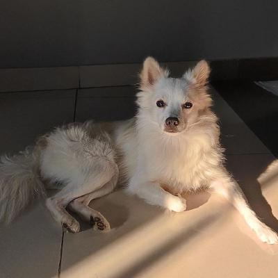

##Portfolio

Welcome to my personal portfolio! I'm a passionate **developer** with experience in various technologies. Below you’ll find more information about me, my skills, projects, and how you can contact me.

---

## About Me

Hi! I'm Arnav Rohilla, a developer with a passion for creating impactful software solutions. I enjoy solving complex problems and building things from the ground up. Currently, I am focused on **Web Development**. Below, you’ll find details on my education, skills, and projects.

### My Skills
| Language/Framework  | Level       | Experience |
|---------------------|-------------|------------|
| **JavaScript**      | Intermediate| 2+ years   |
| **Python**          | Advanced    | 3+ years   |
| **React**           | Intermediate| 1+ year    |
| **Node.js**         | Intermediate| 1+ year    |
| **HTML/CSS**        | Advanced    | 3+ years   |
| **SQL**             | Intermediate| 1 year     |

---

## Education

### Malaviya National Institute of Technology, Jaipur
*Bachelor of Technology in Computer Science*  
**Year of Graduation:** 2027

Relevant Coursework:
- Data Structures and Algorithms
- Web Development
- Database Systems
- Object-Oriented Programming
- Machine Learning

---

## Projects

Here are some of the projects I’ve worked on. Feel free to explore their code or visit their live versions.

### 1. **Project Title**  
   *Description*: A brief summary of the project, its goal, and its impact.  
   *Technologies*: JavaScript, React, Node.js  
   *GitHub*: [Link to GitHub Repository](https://github.com/username/project)  
   *Live Demo*: [Link to Live Demo](https://projectlink.com)

### 2. **Project Title**  
   *Description*: A brief summary of the project, its goal, and its impact.  
   *Technologies*: Python, Flask, SQL  
   *GitHub*: [Link to GitHub Repository](https://github.com/username/project)  
   *Live Demo*: [Link to Live Demo](https://projectlink.com)

---

## Interests

In my spare time, I enjoy exploring new technologies, working on side projects, and contributing to open-source projects. Here are some of my interests:

- **Machine Learning**: Exploring the intersection of AI and development.
- **Game Development**: Creating simple 2D games using Unity and C#.
- **DevOps**: Learning about CI/CD pipelines and automation tools.
- **Music**: I play the guitar and enjoy experimenting with music production software.

---

## Contact Me

Feel free to reach out to me for job opportunities, collaborations, or just to chat about tech! You can reach me through any of the following platforms:

- **Email**: [2023UCP1832@mnit.ac.in](mailto:2023UCP1832@mnit.ac.in)
- **LinkedIn**: [linkedin.com/in/arnav-rohilla](https://www.linkedin.com/in/arnav-rohilla)
- **GitHub**: [github.com/arnavr0](https://github.com/arnavr0)

---

## Resume

You can download my resume by clicking the link below:

[Download my Resume](document2.pdf)

---

## Testimonials

> "An exceptional leader who always goes the extra mile."  
— **Nikhil Kumar**, teammate at MNIT Jaipur

> "A great team player with a passion for coding and problem-solving."  
— **Ayush Dhimmar**, collegue at MNIT Jaipur

---

